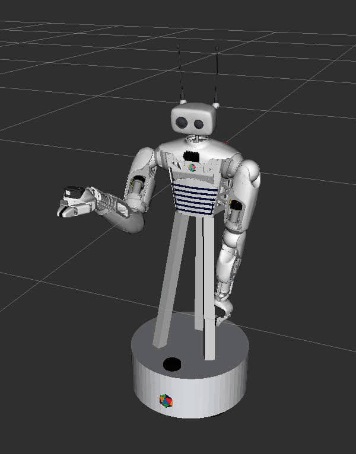

# Reachy2 symbolic inverse kinematics

[](https://github.com/psf/black)
 


A kinematics library that provides two core features for Reachy2:
- A **symbolic inverse kinematics solver**. Handles joint limits, it's precise, solves reachability questions and provides complete knowledge of the nullspace.
- A **control algorithm** to follow trajectories in task space. e.g., during teleoperation.

<div style="display: flex; justify-content: space-around;">

<div>
  
  <p style="text-align: center;">Reachy2 things</p>
</div>

<div>
  
  <p style="text-align: center;">Null space visualisation</p>
</div>

</div>


## Understanding how it works
The main ideas behind the symbolic solution are fairly straightforward. We made a video explaining the concepts below (in French with English subtitles):

<p align="center">
  <a href="https://youtu.be/FHZdJbMAmRA?si=wepM4vH2sNLo85QP&t=344" title="IK explained">
    
  </a>
</p>


## Install

Use the following command to install:

```console
$ pip install -e .[dev]
```
The *[dev]* option includes tools for developers.


## Unit tests

To ensure everything is functioning correctly, run the unit tests.

```console
$ pytest 
```

Some unit tests need [Placo](https://github.com/pollen-robotics/reachy_placo) and some need reachy2_sdk.

You can decide which test you want to run with a flag.
- sdk : run tests with sdk
- placo : run tests with placo
- cicd : run tests using only reachy2_symbolic_ik

Example :

```console
$ pytest -m cicd
```

## URDF

A URDF file is provided in 'src/config_files/reachy2.urdf'. This file is used if the user does not provide a URDF file when initializing the ControlIK class.

To regenerate the URDF file, you can use the following command from the root of the repository in the Docker container:

```console
$ xacro ../../reachy_ws/src/reachy2_core/reachy_description/urdf/reachy.urdf.xacro "use_fake_hardware:=true" > src/config_files/reachy2.urdf
```
